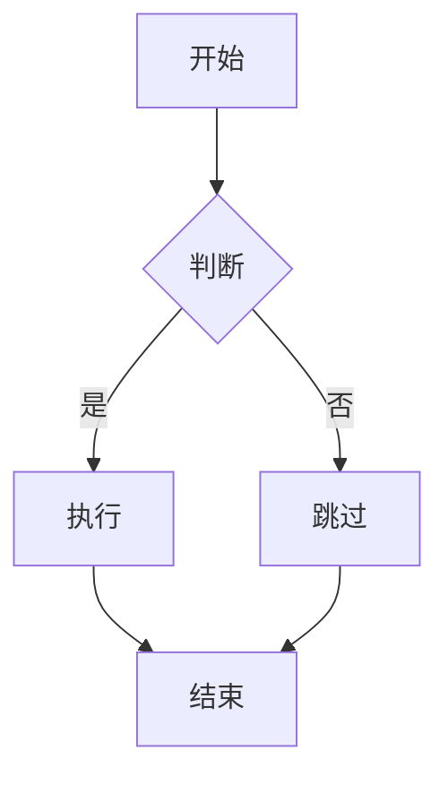
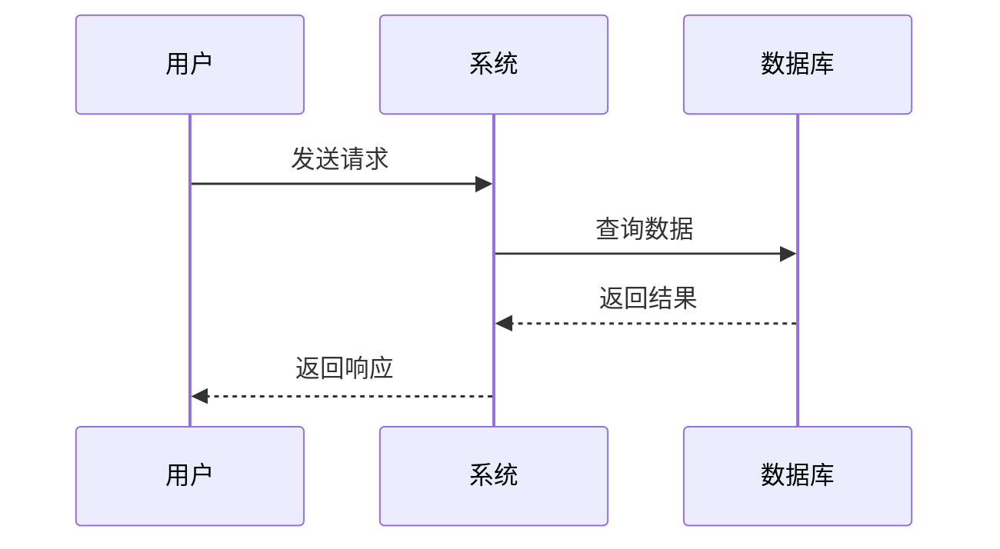
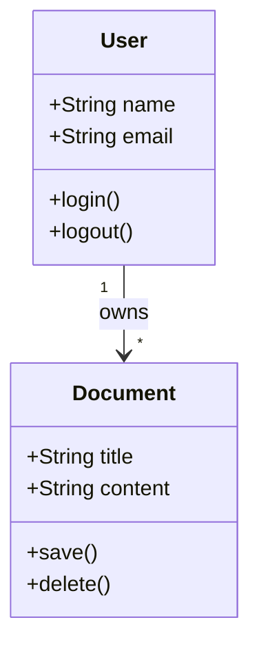
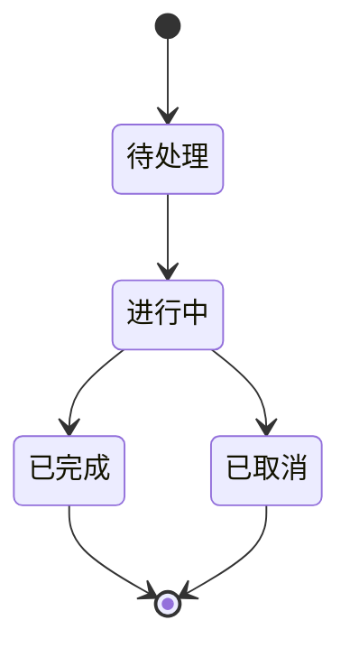
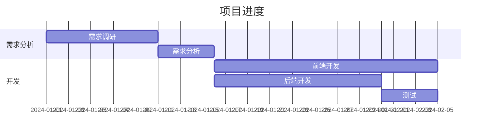
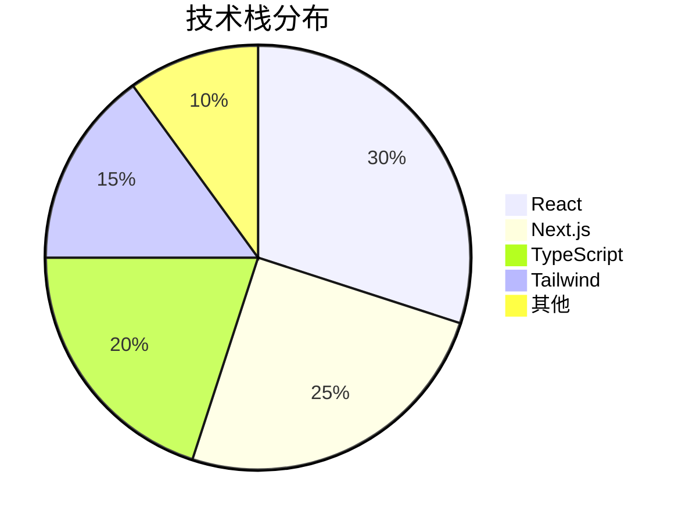
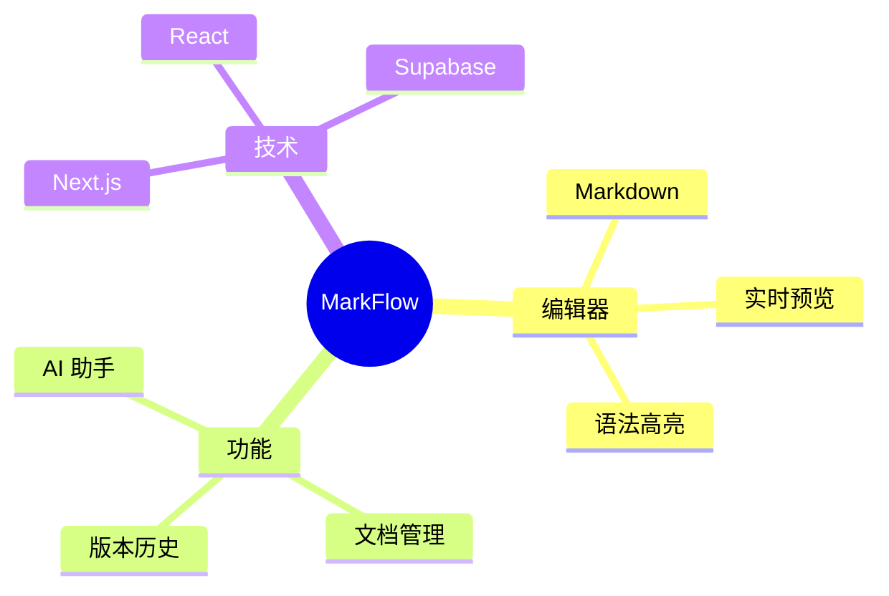
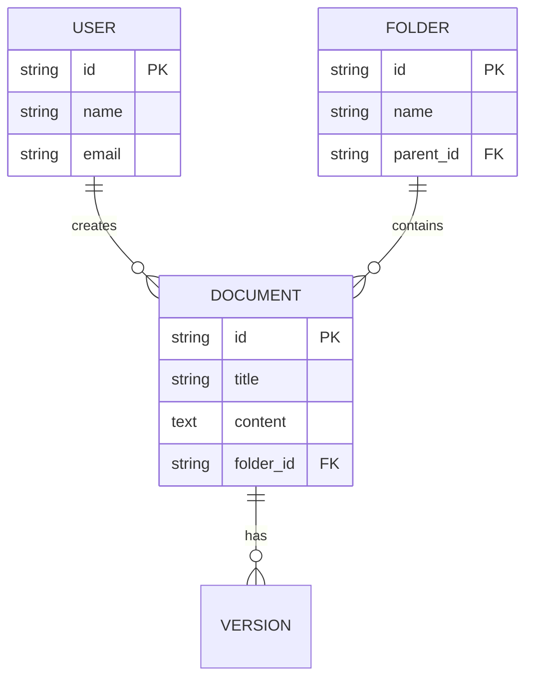
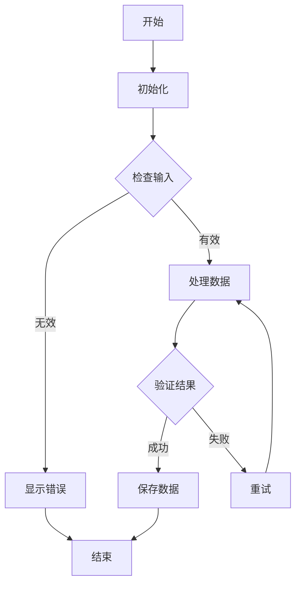

# 数学公式与图表使用指南

## 支持的功能

MarkFlow 现已支持：
- ✅ 数学公式渲染（KaTeX）
- ✅ 流程图、时序图等图表（Mermaid）
- ✅ GitHub Flavored Markdown（GFM）
- ✅ 代码语法高亮

## 数学公式

### 行内公式

使用 `$...$` 包裹数学公式。

**示例：**
```
质能方程是 $E = mc^2$，这是爱因斯坦最著名的公式。
```

**效果：**
质能方程是 $E = mc^2$，这是爱因斯坦最著名的公式。

### 块级公式

使用 `$$...$$` 包裹数学公式。

**示例：**
```
$$
x = \frac{-b \pm \sqrt{b^2 - 4ac}}{2a}
$$
```

**效果：**
$$
x = \frac{-b \pm \sqrt{b^2 - 4ac}}{2a}
$$

### 常用数学符号

| 符号 | LaTeX | 示例 |
|------|-------|------|
| 分数 | `\frac{a}{b}` | `$\frac{a}{b}$` |
| 下标 | `x_{n}` | `$x_{n}$` |
| 上标 | `x^{n}` | `$x^{n}$` |
| 求和 | `\sum_{i=1}^{n}` | `$\sum_{i=1}^{n}$` |
| 积分 | `\int_{a}^{b}` | `$\int_{a}^{b}$` |
| 希腊字母 | `\alpha`, `\beta` | `$\alpha, \beta$` |
| 根号 | `\sqrt{x}` | `$\sqrt{x}$` |
| 矩阵 | `\begin{pmatrix}...\end{pmatrix}` | 见块级公式示例 |

## 图表（Mermaid）

### 流程图



### 时序图



### 类图



### 状态图



### 甘特图



### 饼图



### 思维导图



### 实体关系图



## 混合使用

你可以在同一文档中混合使用数学公式和图表：

$$
\oint_C \mathbf{E} \cdot d\mathbf{l} = -\frac{d\Phi_B}{dt}
$$


## 高级示例

### 复杂数学公式

$$
\begin{aligned}
f(x) &= \int_{-\infty}^{\infty} \hat{f}(\xi)\,e^{2\pi i \xi x} \,d\xi \\
&= \sum_{n=-\infty}^{\infty} c_n e^{inx}
\end{aligned}
$$

### 复杂流程图



## 快速开始

1. 打开 MarkFlow 编辑器
2. 创建新文档或选择"数学公式与图表"模板
3. 输入数学公式或图表代码
4. 切换到预览模式查看渲染效果

## 注意事项

- 数学公式必须使用 `$` 或 `$$` 包裹
- 图表代码必须使用 ` ```mermaid` 代码块
- 支持所有标准的 LaTeX 数学符号
- 图表渲染需要 JavaScript 支持（预览模式）

## 资源链接

- [KaTeX 官方文档](https://katex.org/docs/supported.html)
- [Mermaid 官方文档](https://mermaid.js.org/intro/)
- [LaTeX 数学符号参考](https://oeis.org/wiki/List_of_LaTeX_mathematical_symbols)

---

如有问题，请参考模板文档或提交 Issue。
