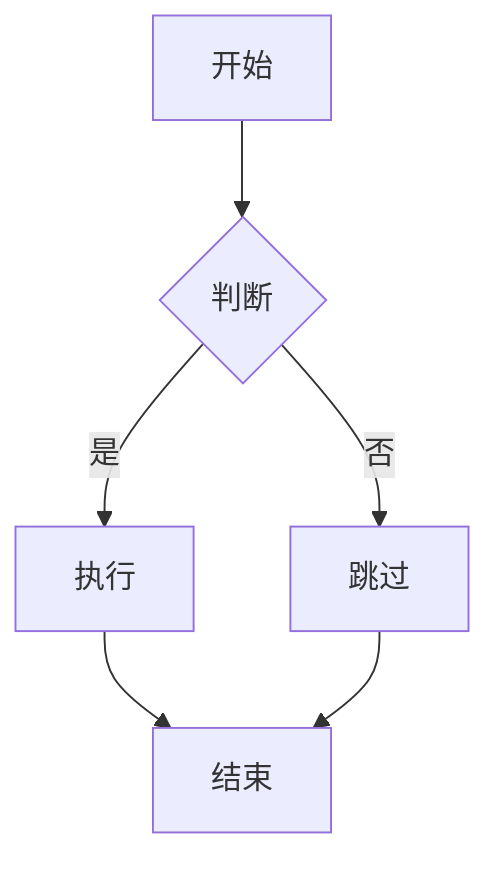
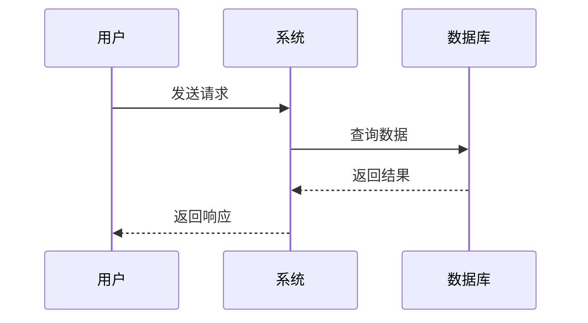
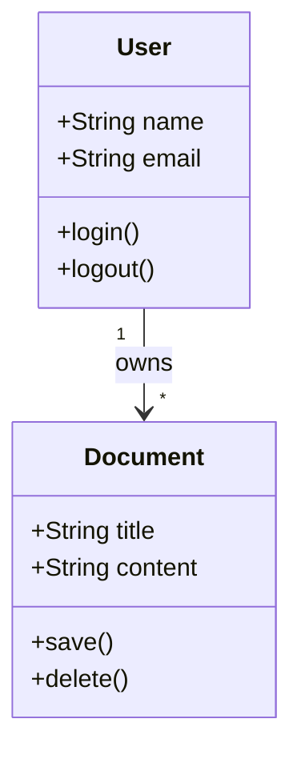
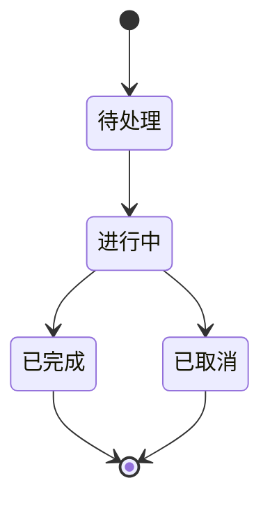
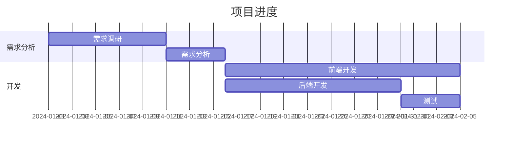
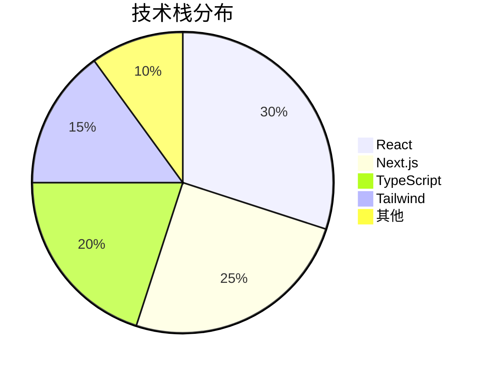
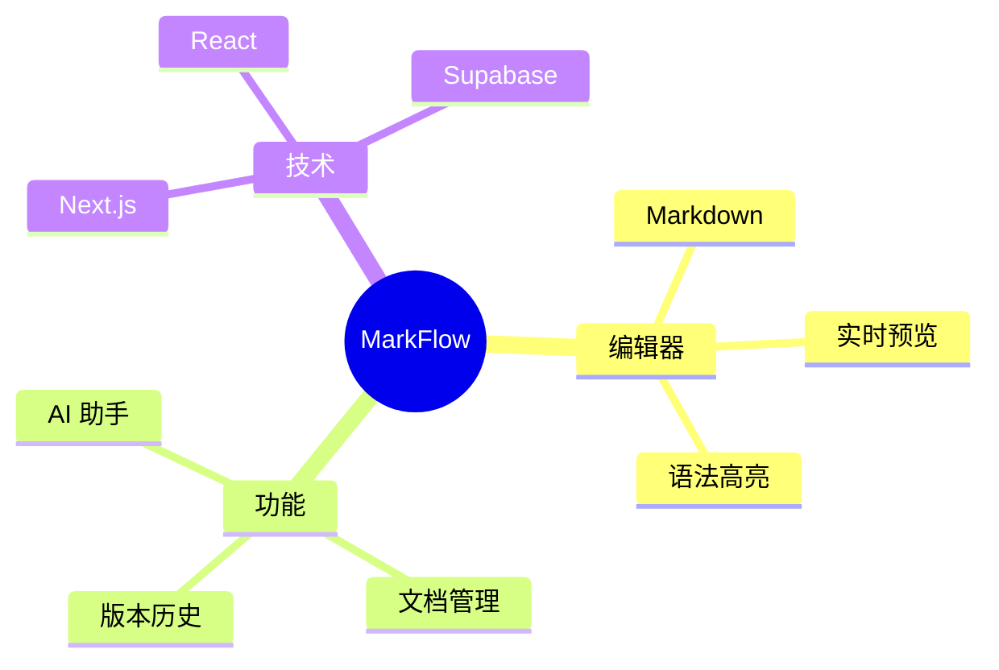
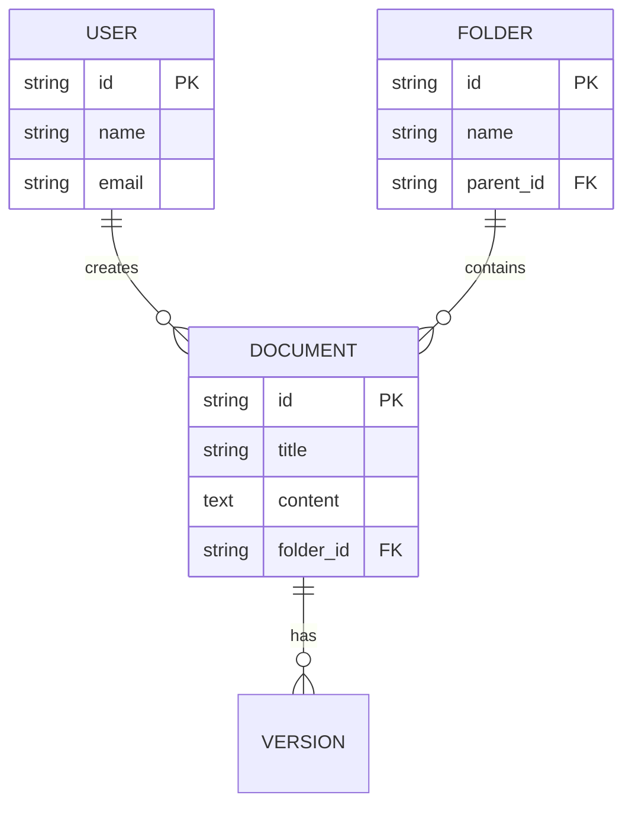
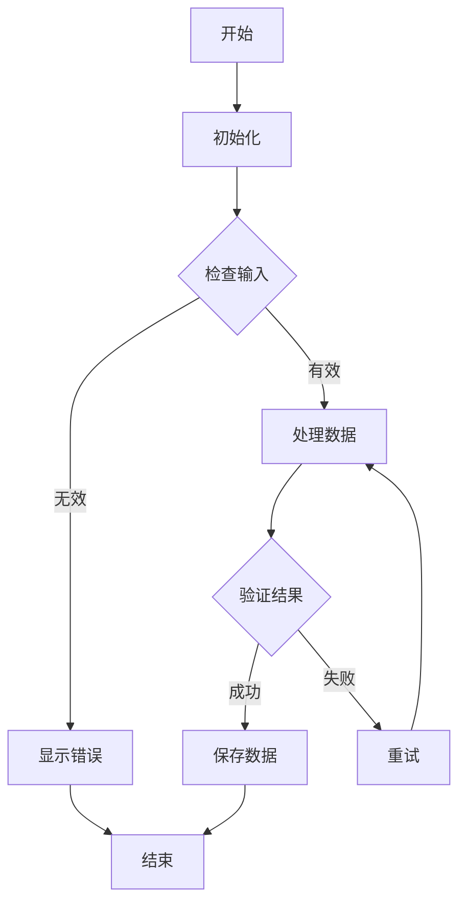

# 数学公式与图表使用指南

## 支持的功能

Therex 现已支持：
- ✅ 数学公式渲染（KaTeX）
- ✅ 数据可视化图表（ECharts）
- ✅ 流程图、时序图等图表（Mermaid）
- ✅ GitHub Flavored Markdown（GFM）
- ✅ 代码语法高亮

## 数学公式

### 行内公式

使用 `$...$` 包裹数学公式。

**示例：**
```
质能方程是 $E = mc^2$，这是爱因斯坦最著名的公式。
```

**效果：**
质能方程是 $E = mc^2$，这是爱因斯坦最著名的公式。

### 块级公式

使用 `$$...$$` 包裹数学公式。

**示例：**
```
$$
x = \frac{-b \pm \sqrt{b^2 - 4ac}}{2a}
$$
```

**效果：**
$$
x = \frac{-b \pm \sqrt{b^2 - 4ac}}{2a}
$$

### 常用数学符号

| 符号 | LaTeX | 示例 |
|------|-------|------|
| 分数 | `\frac{a}{b}` | `$\frac{a}{b}$` |
| 下标 | `x_{n}` | `$x_{n}$` |
| 上标 | `x^{n}` | `$x^{n}$` |
| 求和 | `\sum_{i=1}^{n}` | `$\sum_{i=1}^{n}$` |
| 积分 | `\int_{a}^{b}` | `$\int_{a}^{b}$` |
| 希腊字母 | `\alpha`, `\beta` | `$\alpha, \beta$` |
| 根号 | `\sqrt{x}` | `$\sqrt{x}$` |
| 矩阵 | `\begin{pmatrix}...\end{pmatrix}` | 见块级公式示例 |

## 数据可视化（ECharts）

ECharts 是一个强大的数据可视化库，支持多种图表类型。

### 柱状图

```echarts
{
  "title": {
    "text": "销售数据统计",
    "left": "center"
  },
  "tooltip": {},
  "xAxis": {
    "data": ["产品A", "产品B", "产品C", "产品D", "产品E"]
  },
  "yAxis": {},
  "series": [{
    "name": "销量",
    "type": "bar",
    "data": [120, 200, 150, 80, 70]
  }]
}
```

### 折线图

```echarts
{
  "title": {
    "text": "月度趋势",
    "left": "center"
  },
  "tooltip": {
    "trigger": "axis"
  },
  "xAxis": {
    "type": "category",
    "data": ["1月", "2月", "3月", "4月", "5月", "6月"]
  },
  "yAxis": {
    "type": "value"
  },
  "series": [{
    "name": "收入",
    "type": "line",
    "data": [820, 932, 901, 934, 1290, 1330]
  }]
}
```

### 饼图

```echarts
{
  "title": {
    "text": "市场份额",
    "left": "center"
  },
  "tooltip": {
    "trigger": "item"
  },
  "legend": {
    "orient": "vertical",
    "left": "left"
  },
  "series": [{
    "name": "市场份额",
    "type": "pie",
    "radius": "50%",
    "data": [
      {"value": 1048, "name": "搜索引擎"},
      {"value": 735, "name": "直接访问"},
      {"value": 580, "name": "邮件营销"},
      {"value": 484, "name": "联盟广告"},
      {"value": 300, "name": "视频广告"}
    ]
  }]
}
```

### 散点图

```echarts
{
  "title": {
    "text": "散点图示例"
  },
  "xAxis": {},
  "yAxis": {},
  "series": [{
    "symbolSize": 20,
    "data": [
      [10.0, 8.04],
      [8.0, 6.95],
      [13.0, 7.58],
      [9.0, 8.81],
      [11.0, 8.33],
      [14.0, 9.96],
      [6.0, 7.24],
      [4.0, 4.26],
      [12.0, 10.84],
      [7.0, 4.82],
      [5.0, 5.68]
    ],
    "type": "scatter"
  }]
}
```

### ECharts 配置说明

ECharts 使用 JSON 格式的配置，支持所有标准 ECharts 配置选项。

- 使用 ` ```echarts` 代码块包裹配置
- 配置必须是有效的 JSON 格式
- 参考完整的配置选项：[ECharts 官方文档](https://echarts.apache.org/zh/option.html)

## 图表（Mermaid）

### 流程图



### 时序图



### 类图



### 状态图



### 甘特图



### 饼图



### 思维导图



### 实体关系图



## 混合使用

你可以在同一文档中混合使用数学公式、ECharts 图表和 Mermaid 图表：

### 数学公式 + Mermaid

$$
\oint_C \mathbf{E} \cdot d\mathbf{l} = -\frac{d\Phi_B}{dt}
$$


### 数学公式 + ECharts

$$
f(x) = \sum_{n=0}^{\infty} \frac{f^{(n)}(a)}{n!} (x-a)^n
$$

```echarts
{
  "title": {
    "text": "函数可视化"
  },
  "xAxis": {
    "type": "value"
  },
  "yAxis": {
    "type": "value"
  },
  "series": [{
    "type": "line",
    "data": [
      [0, 0],
      [1, 1],
      [2, 4],
      [3, 9],
      [4, 16]
    ]
  }]
}
```

### 三者混合

$$
E = mc^2
$$


```echarts
{
  "series": [{
    "type": "pie",
    "data": [
      {"value": 335, "name": "直接访问"},
      {"value": 310, "name": "邮件营销"},
      {"value": 234, "name": "联盟广告"},
      {"value": 135, "name": "视频广告"},
      {"value": 1548, "name": "搜索引擎"}
    ]
  }]
}
```

## 注意事项

### 数学公式
- 使用 `$...$`（行内）和 `$$...$$`（块级）包裹
- 支持 LaTeX 数学语法

### ECharts 图表
- 使用 ` ```echarts` 代码块包裹
- 配置必须是有效的 JSON 格式
- 支持所有 ECharts 标准配置选项
- 图表会自动响应容器大小变化

### Mermaid 图表
- 使用 ` ```mermaid` 代码块包裹
- 支持多种图表类型：flowchart, sequence, class, state, er, gantt, pie, mindmap
- 参考完整的语法：[Mermaid 官方文档](https://mermaid.js.org/intro/)

## 最佳实践

1. **选择合适的图表类型**
   - 数据可视化：使用 ECharts
   - 流程、逻辑：使用 Mermaid
   - 关系结构：使用 Mermaid ER/Class 图

2. **优化性能**
   - 避免在同一文档中使用过多大型图表
   - ECharts 图表会自动响应容器大小
   - 使用 `series` 数组组合多个图表

3. **可访问性**
   - 为图表添加清晰的标题
   - 使用图例说明数据含义
   - 考虑使用 tooltip 提供详细信息

## 更多资源

- [KaTeX 数学公式参考](https://katex.org/docs/supported.html)
- [ECharts 配置手册](https://echarts.apache.org/zh/option.html)
- [Mermaid 语法指南](https://mermaid.js.org/intro/)
- [GitHub Flavored Markdown](https://github.github.com/gfm/)

## 高级示例

### 复杂数学公式

$$
\begin{aligned}
f(x) &= \int_{-\infty}^{\infty} \hat{f}(\xi)\,e^{2\pi i \xi x} \,d\xi \\
&= \sum_{n=-\infty}^{\infty} c_n e^{inx}
\end{aligned}
$$

### 复杂流程图



## 快速开始

1. 打开 MarkFlow 编辑器
2. 创建新文档或选择"数学公式与图表"模板
3. 输入数学公式或图表代码
4. 切换到预览模式查看渲染效果

## 注意事项

- 数学公式必须使用 `$` 或 `$$` 包裹
- 图表代码必须使用 ` ```mermaid` 代码块
- 支持所有标准的 LaTeX 数学符号
- 图表渲染需要 JavaScript 支持（预览模式）

## 资源链接

- [KaTeX 官方文档](https://katex.org/docs/supported.html)
- [Mermaid 官方文档](https://mermaid.js.org/intro/)
- [LaTeX 数学符号参考](https://oeis.org/wiki/List_of_LaTeX_mathematical_symbols)

---

如有问题，请参考模板文档或提交 Issue。
